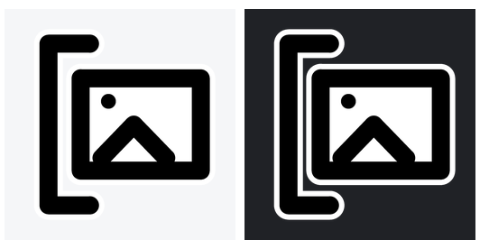

# CtrlV 存图（CtrlV Paste Image）

> 在 Windows **资源管理器**或**桌面**上按 `Ctrl+V`，把剪贴板里的图片直接存到当前文件夹。

一个极小的 Windows 托盘工具：**单文件 exe 约 20 KB**，不打包任何运行时，双击即用。

## 特性

- **Ctrl+V 存图**：前台是资源管理器窗口 → 存到该窗口当前打开的文件夹；前台是桌面 → 存到桌面文件夹。
- **也能存文字**：剪贴板里是文字（而非图片）时，直接存成 `.txt` —— 文件名取文字内容（自动过滤 `\ / : * ? " < > |` 等非法字符、超长截断），内容就是复制的原文（UTF-8）。
- **矢量复制（如 Adobe Illustrator）**：AI 复制**图形**时，剪贴板里的“文字”其实是 **SVG 源码** —— 程序据此判定为图形，改用剪贴板里的 `PNG`/位图存成图片；AI 复制**文字**时是纯文字（`UnicodeText`）→ 存成 `.txt`。只有 EMF/WMF 而无位图时才尝试渲染成图片，都拿不到就忽略。复制文件（资源管理器里 `Ctrl+C`）交给系统处理，不干预。
- **只认资源管理器 / 桌面**：在其他程序里按 `Ctrl+V` 完全不受影响（使用全局低级键盘钩子，不拦截按键）。
- **几乎无延迟**：复制图片时就后台预读剪贴板，解决 `Win+Shift+S` 等“延迟渲染”导致的几秒卡顿；按 `Ctrl+V` 时直接落盘，实测约 30–80 ms。
- **保持原分辨率**：优先保存剪贴板的原始 `PNG` 格式（逐字节写入）；程序声明 DPI 感知，避免高分屏下被系统缩放变糊。
- **资源管理器即时刷新**：保存后主动通知 Shell 显示新文件。
- **托盘菜单**：`开机自启` 开关（写 `HKCU\...\Run`，移动 exe 后自动更新路径）、`退出`。
- **零依赖**：只用系统自带的 .NET Framework / Win32 / GDI+，exe 内不含运行时。

## 系统要求 / 支持平台

- **操作系统**：Windows 10 / 11
- **CPU 架构**：x64 / x86（exe 为 AnyCPU；ARM64 版 Windows 也可通过 x64 模拟运行）
- **运行时**：系统自带 .NET Framework 4.x，无需额外安装

## 使用

1. 运行 `CtrlV存图.exe`（后台常驻，右下角出现托盘图标）。
2. 用任意方式把图片复制到剪贴板（例如 `Win+Shift+S` 截图、浏览器里复制图片）。
3. 打开一个文件夹窗口或回到桌面，按 `Ctrl+V`：
   - 剪贴板是**图片** → 存成 `截图_YYYYMMDD_HHMMSS.png`；
   - 剪贴板是**文字** → 存成 `<文字内容>.txt`。

右键托盘图标：**开机自启**（点击勾选 / 再点取消）、**退出**。

## 从源码构建

无需安装任何东西，用系统自带的 .NET Framework 编译器即可：

```bat
build.bat
```

产物：`dist\CtrlV存图.exe`。

> 等价的命令行：
>
> ```bat
> %WINDIR%\Microsoft.NET\Framework64\v4.0.30319\csc.exe /target:winexe /optimize+ ^
>   /out:"dist\CtrlV存图.exe" ^
>   /r:System.dll /r:System.Drawing.dll /r:System.Windows.Forms.dll ^
>   /win32icon:paste.ico paste_image.cs
> ```

## 配置

首次运行会生成 `%APPDATA%\CtrlV存图\settings.ini`：

```ini
prefix=截图
beep=1
min_interval=0.6
```

- `prefix`：文件名前缀
- `beep`：保存时是否响一声（`1` / `0`）
- `min_interval`：两次保存的最小间隔秒数（防连击）

## 图标

`make_paste_icon.py` 用 Pillow 生成 `paste.ico`（黑白线条：门 + 图片，多尺寸）：

```bash
pip install pillow
python make_paste_icon.py
```

| 深色背景 | 浅色背景 |
|---|---|
|  | |

## 许可证

[GNU GPL v3.0 或更高版本](LICENSE) © 2026 xqmake7
